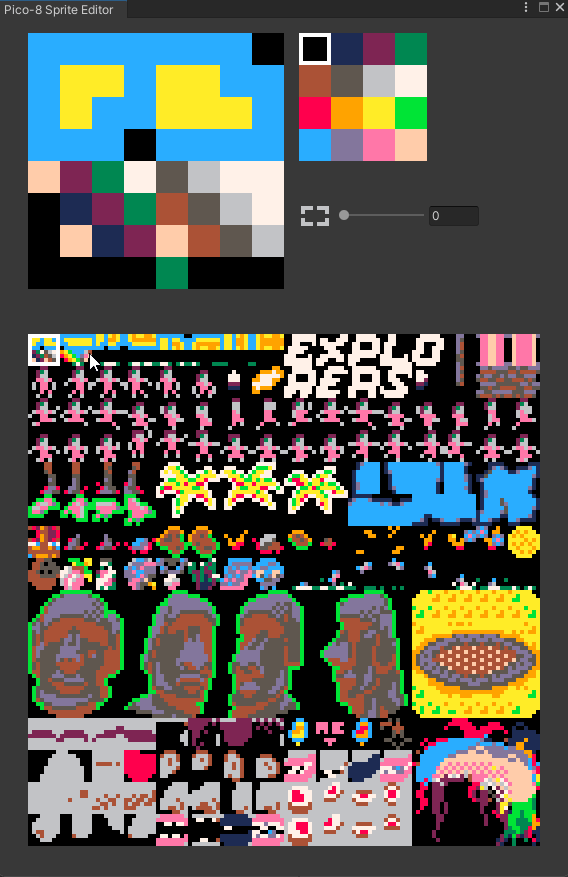

# PICO-8 Sprite Editor for Unity

> A sprite editor for Unity that brings PICO-8's charming workflow and constraints to game development in Unity.

---

## Overview

This tool ports PICO-8 sprite editing functionality into Unity, allowing developers to enjoy the same efficient, creative workflow that makes PICO-8 game development so enjoyable. Work with PICO-8's characteristic aesthetic and palette directly within the Unity editor.

---

## Features

- **PICO-8 Style Sprites** — Create sprites with PICO-8 constraints in Unity
- **16-Color Palette** — PICO-8's iconic fixed color palette
- **Pixel-Perfect Grid** — Clear visual grid for pixel-level control
- **Efficient Workflow** — Quick iteration and creative development
- **Unity Integration** — Seamless asset pipeline for game development
- **Real-time Preview** — See sprites in game context immediately
- **Sprite sheet support** — Organize multiple sprites efficiently

---

## Screenshots



---

## Getting Started

### Requirements

- **Unity 2020.3 LTS** or later
- **C# scripting enabled**

### Installation

1. Clone or download this repository
2. Place the editor package in your Unity project's `Assets/` directory
3. The editor window will appear in the Window menu

### First Steps

1. Open **Window → PICO-8 Sprite Editor**
2. Create new sprite or open existing
3. Select colors from the 16-color palette
4. Paint directly on the 8×8 or 16×16 canvas
5. Save as Unity sprite asset

---

## Workflow

### Basic Sprite Creation

1. **New Sprite** — Click "New Sprite" button
2. **Select size** — Choose 8×8 or 16×16 pixels
3. **Paint** — Click/drag to paint pixels
4. **Pick color** — Left-click palette for paint color
5. **Erase** — Right-click to erase or use eraser tool
6. **Save** — Save as `.sprite` or PNG asset

### Sprite Sheet Management

Organize multiple sprites efficiently:
- **Grid layout** — Automatically arrange sprites
- **Batch operations** — Apply transformations to multiple sprites
- **Quick export** — Export all as sprite sheet

### Palette

PICO-8's signature 16-color palette:
- **Colors 0-15** — Predefined PICO-8 palette
- **Recolor** — Remap colors for variations
- **Custom palettes** — Create alternate color schemes

---

## Integration with Unity

### Using Sprites in Games

```csharp
// Load sprite from editor
Sprite mySprite = Resources.Load<Sprite>("Sprites/my_sprite");

// Apply to SpriteRenderer
GetComponent<SpriteRenderer>().sprite = mySprite;

// Use in UI
GetComponent<Image>().sprite = mySprite;
```

### Sprite Animation

Create animations using sprite sequences:
1. Edit multiple sprites in sequence
2. Use Unity Animator with sprite transitions
3. Or programmatically change sprite each frame

---

## Features in Detail

### Drawing Tools

- **Pencil** — Single pixel drawing
- **Brush** — Variable brush sizes
- **Eraser** — Remove pixels
- **Fill** — Flood fill with color
- **Line** — Draw straight lines
- **Rectangle** — Draw rectangles
- **Circle** — Draw circles

### View Options

- **Zoom** — Adjust magnification (1x to 16x)
- **Grid** — Toggle pixel grid display
- **Background** — Change editor background
- **Checkerboard** — See transparency clearly
- **Animation preview** — Playback sprite animations

---

## Keyboard Shortcuts

- **Z** — Zoom in
- **X** — Zoom out
- **E** — Eraser tool
- **B** — Brush tool
- **P** — Pencil tool
- **F** — Fill tool
- **Ctrl+S** — Save sprite
- **Ctrl+Z** — Undo
- **Ctrl+Y** — Redo

---

## Tips & Best Practices

### PICO-8 Aesthetics
- Stay within 8×8 or 16×16 grids
- Use limited palette for cohesion
- Embrace pixel art constraints
- Use 1-2 px outlines for contrast

### Performance
- Keep sprite counts reasonable
- Use sprite sheets for batch rendering
- Reuse sprites across scenes

### Organization
- Group related sprites in folders
- Use consistent naming (e.g., `player_idle_01`)
- Keep separate sprite sheets for different characters

---

## Technical Details

- **Language:** C# (Unity)
- **Pixel format:** RGBA32
- **Export formats:** PNG, Sprite asset
- **Save location:** `Assets/Resources/Sprites/` (default)

---

## Limitations

- Maximum sprite size: 32×32 pixels
- Fixed to 16-color palette (custom palettes upcoming)
- Sprite sheets limited to 512×512 texture

---

## Future Enhancements

- Custom palette support
- Animation timeline editor
- Onion-skin preview for animation
- Sound effect editor
- Map/tileset editor

---

## License

Copyright © Walter Gordy
